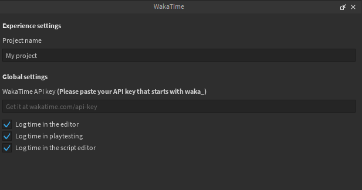

# Roblox Studio WakaTime

This is a plugin for automatically tracking your time spent in Roblox Studio, with support for tracking:

-   Time spent in the code editor (with script names)
-   Time spent playtesting
-   Time spent editing in the viewport

